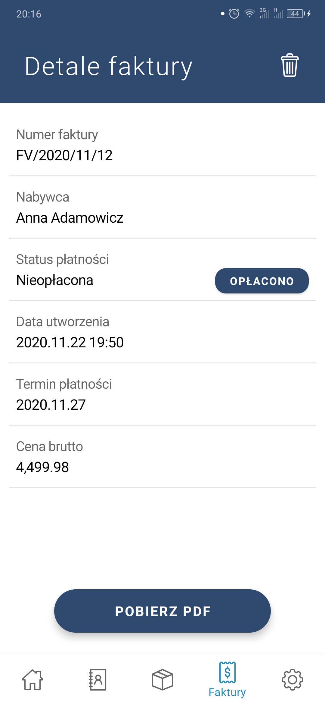

<!-- PROJECT LOGO -->
 

  

[![License][license-shield]][license-url]
![Top language][top-language-shield]
![Contributors][contributors-shield]
![Last commit][last-commit-shield]
[![LinkedIn][linkedin-shield]][linkedin-url]

<h3 style="text-align: center">Business Manager</h3>

  Generate invoices and manage your company with multiple features. 
   
  Android app which is frontend part of system.
   
   
  <a href="https://github.com/InBinaryWorld/BM-Servers"><strong>Explore the backend services »</strong></a>
   
  <a href="https://github.com/InBinaryWord/BM-MobileApp/blob/master/diploma_paper.pdf"><strong>Explore the diploma paper »</strong></a>
   
  <a href="https://github.com/InBinaryWorld/BM-MobileApp"><strong>Explore the documents »</strong></a>
   
   
  <a href="https://github.com/InBinaryWorld/BM-MobileApp/issues">Report Bug</a>
  ·
  <a href="https://github.com/InBinaryWorld/BM-MobileApp/issues">Request Feature</a>

<!-- TABLE OF CONTENTS -->

## Table of Contents

* [About the Project](#about-the-project)
    * [How it started?](#how-it-started)
    * [Built With](#built-with)
* [Getting Started](#getting-started)
* [Product description](#product-description)
* [License](#license)
* [Contact](#contact)

<!-- ABOUT THE PROJECT -->

## About The Project

Business Manager is a rest api client that helps micro-entrepreneurs to manage finances, invoices, resources,
inventory and contacts. It's integrated with social medias as a identity providers and automatize processes to 
simplify all possible actions. 

### How it started?

The motivation for the development of the Business Manager system was to create a useful system as part of the 
diploma project. The one-man business opening in my immediate vicinity has shown that there is a need for 
business support systems. The most desirable function of the system is the generator of invoices that each 
company issues. Applications available in stores are usually either paid or of low quality. Therefore, the main 
goal was to develop a refined invoicing solution that I already knew was in demand among the family. The scope 
of the system's functionality is much wider, but most importantly, they all influence each other, introducing 
simplifications for the user.

### Built With

Android app was created with:

* [Google Mobile Vision](https://developers.google.com/vision)
* [Google Auth](https://developers.google.com/identity/sign-in/android/start)
* [Facebook Login](https://developers.facebook.com/docs/facebook-login/android/)
* [Material Design](https://m2.material.io/develop/android)
* [Lombok](https://projectlombok.org/)
* [Dagger](https://dagger.dev/)
* [RxJava3](https://reactivex.io/)
* [RxLifecycle](https://github.com/trello/RxLifecycle)
* [Retrofit](https://square.github.io/retrofit/)
* [OkHttp](https://square.github.io/okhttp/)
* [Google Gson](https://github.com/google/gson)

<!-- GETTING STARTED -->

## Getting started

[Please check chapter #7 of my thesis >>](https://github.com/InBinaryWord/BM-MobileApp/blob/master/diploma_paper.pdf)

## Product description

The following sections describe the functionality of the system and contain screenshots 
of a fragment of the user interface.

### Login & Welcome pages.

The app is integrated with Google and Facebook identity providers, allowing users to register 
and log in using accounts from these platforms. The application supports the silent login mode.
This means that the user will be able to skip the login view after pairing his account and 
will be automatically logged in in the background.

The system supports the management of many companies on one account. After logging in, the 
user selects or creates a company and goes to the application dashboard where statistics 
are presented.

  
  &nbsp;&nbsp;&nbsp;&nbsp;&nbsp;&nbsp;&nbsp;&nbsp;&nbsp;&nbsp;&nbsp;
  
  &nbsp;&nbsp;&nbsp;&nbsp;&nbsp;&nbsp;&nbsp;&nbsp;&nbsp;&nbsp;&nbsp;
  

### Settings & Contacts

In the settings tab user is allowed to control silent login function by enabling and disabling 
them. This view allows user also to:
* modify selected company,
* switch between owned companies,
* access to bank account management,
* log out.

Contacts tab with defined individual and company contacts allow user to make a call directly.
But the most important advantage to adding them to your app is that they can be used in
invoice generation form, simplifying the process and avoiding typing all data every time.

Note: All forms in the application are secured with validators. All errors are marked 
appropriately to improve user experience.

  
  &nbsp;&nbsp;&nbsp;&nbsp;&nbsp;&nbsp;&nbsp;&nbsp;&nbsp;&nbsp;&nbsp;
  
  &nbsp;&nbsp;&nbsp;&nbsp;&nbsp;&nbsp;&nbsp;&nbsp;&nbsp;&nbsp;&nbsp;
  

### Inventory

The resources tab is a place where user can find his warehouses and products/services models.
Each warehouse has its own register of products contained in it. The user can check the stock 
of a given product using text search, but also scanning barcode or qrcode.

Note: Defined products and services models can be used in invoice generation flow. 

  
  &nbsp;&nbsp;&nbsp;&nbsp;&nbsp;&nbsp;&nbsp;&nbsp;&nbsp;&nbsp;&nbsp;
  
  &nbsp;&nbsp;&nbsp;&nbsp;&nbsp;&nbsp;&nbsp;&nbsp;&nbsp;&nbsp;&nbsp;
  

### Finance & Invoicing section

The views in this section allow users to take care of their finances. Presented at top
statistics leads to finances management with transactions history, and the list below
is a history of created invoices. Every of them has one of the states: paid or not. When 
the user marks an invoice as Paid system automatically creates an income event in 
financial history. The details view is also the place where the user is able to download 
generated earlier invoices.

  
  &nbsp;&nbsp;&nbsp;&nbsp;&nbsp;&nbsp;&nbsp;&nbsp;&nbsp;&nbsp;&nbsp;
  
  &nbsp;&nbsp;&nbsp;&nbsp;&nbsp;&nbsp;&nbsp;&nbsp;&nbsp;&nbsp;&nbsp;
  

Invoice generator features:
* Compliant with Polish tax law.
* Make use of defined for company invoice name prefix.
* Allows to provide predefined contacts with one click.
* Available payment methods: Cash, Bank transfer.
* Allows to fulfill form with predefined bank accounts,.
* Add invoice items with qrcode / barcode. 
* Shows summary preview.
* Generate PDF documents.
* Supports multi-page item list.
* Persist documents in cloud.

  
  &nbsp;&nbsp;&nbsp;&nbsp;&nbsp;&nbsp;&nbsp;&nbsp;&nbsp;&nbsp;&nbsp;
  
  &nbsp;&nbsp;&nbsp;&nbsp;&nbsp;&nbsp;&nbsp;&nbsp;&nbsp;&nbsp;&nbsp;
  

<!-- LICENSE -->
## License

Distributed under the [GNUv3 License][license-url]. See `LICENSE`  for more information.

<!-- CONTACT -->

## Contact

Find me on:

[![LinkedIn][linkedin-shield]][linkedin-url]
[![Github][github-user-shield]][github-user-url]

<!-- MARKDOWN LINKS & IMAGES -->

[license-shield]: https://img.shields.io/github/license/InBinaryWorld/BM-MobileApp
[license-url]: https://github.com/InBinaryWord/BM-MobileApp/blob/master/LICENSE
[top-language-shield]: https://img.shields.io/github/languages/top/InBinaryWorld/BM-MobileApp
[contributors-shield]: https://img.shields.io/github/contributors/InBinaryWorld/BM-MobileApp
[contributors-url]: https://github.com/InBinaryWord/BM-MobileApp/graphs/contributors
[last-commit-shield]:https://img.shields.io/github/last-commit/InBinaryWorld/BM-MobileApp
[linkedin-shield]: https://img.shields.io/badge/-LinkedIn-black.svg?style=flat-square&logo=linkedin&color=175a7a
[linkedin-url]: https://linkedin.com/in/Krzysztof-Szafraniak
[github-user-shield]: https://img.shields.io/badge/-GitHub-black.svg?style=flat-square&logo=github&color=171515
[github-user-url]: https://github.com/InBinaryWorld
